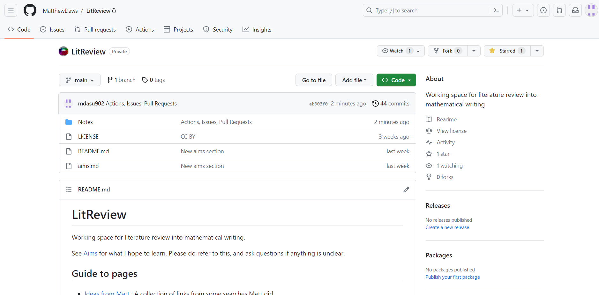

# GitHub-Guide
Using VsCode to create a guide to Github

# Prerequisites
* VsCode should be downloaded via : "https://code.visualstudio.com/download"
* Download Git via : 

## Initial Steps.

1. First Download VsCode and download Git
2. Open the PowerShell Terminal through VsCode
3. Using "git config --global user.name (username) "
4. Using "git config --global user.email (user's email)"
<!-- add picture here -->
5. Now open a Repository on GitHub and name it "My First Repo". Make it private or public
<!-- add picture here -->
6. Use "git init" in the powershell terminal and this should initialise the repository 
7. Within the Powershell terminal use the command "git add remote add origin "GitHub repo Link" ".
This will allow you to connect to GitHub remotely from VsCode.  